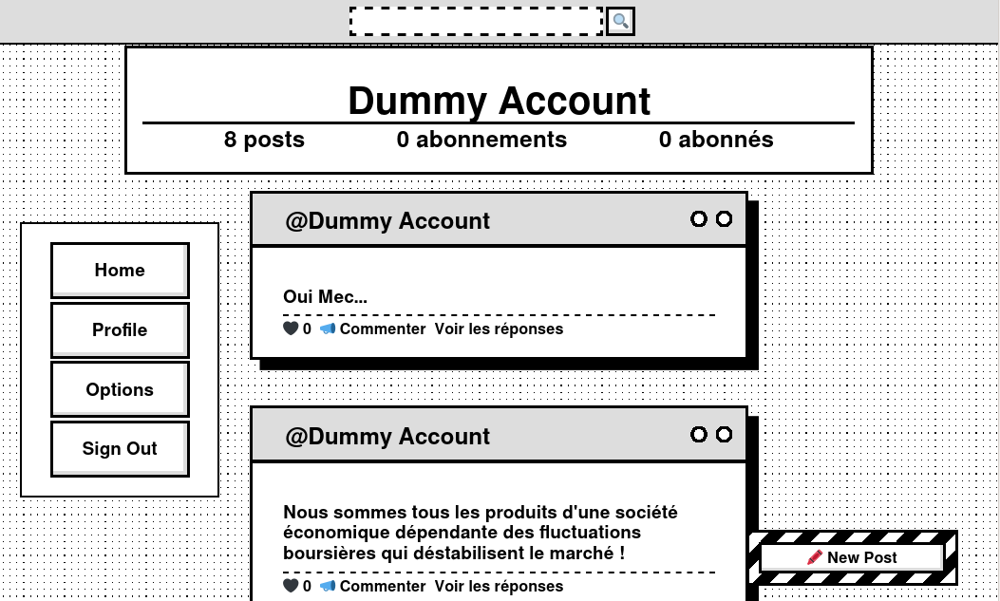

# WOOF

A simple social network.

<p align="center">
 Browser Version

</p>

<p align="center">
 Mobile Version

 </p>                         
 
### Install
Simply clone the repo 

```
git clone "http://github.com/HugoRdet/WOOF
```

Or unzip the .zip archive.


Also, make sure to exec
```npm install```
in both **server** and **client** folders.

### Usage
Run the server -- from the **server** folder:

```
npm run serve
```

Run the App -- from the **client** folder:

```
npm start
```
